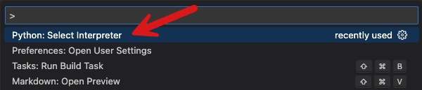
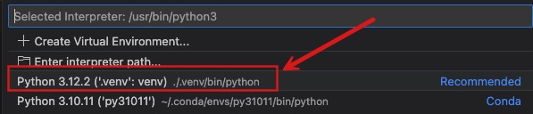
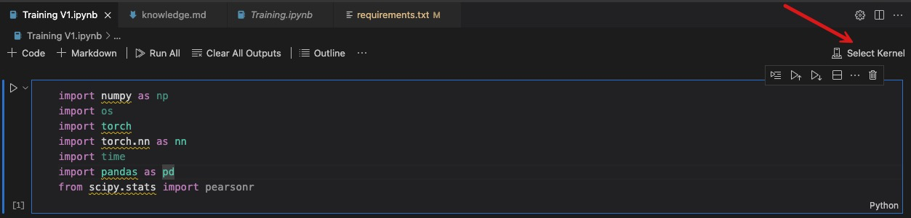
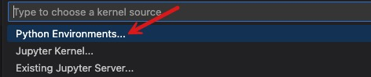
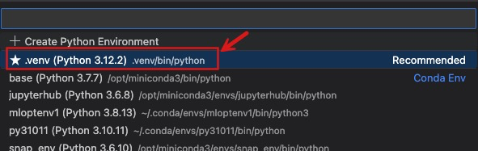

# QueryFormer Forked Repo - README

Query representation learning plays a crucial role in various AI-based database tasks, such as query optimization and database tuning. QueryFormer is a method that uses attention to learn query representation. 

Zhao, Yue, Gao Cong, Jiachen Shi, and Chunyan Miao. "Queryformer: A tree transformer model for query plan representation." Proceedings of the VLDB Endowment 15, no. 8 (2022): 1658-1670.

QueryFormer learns query representations that can be utilized for different prediction tasks. The QueryFormer code, designed for PyTorch, was released over 2 years ago. The python ecosystem has progressed since then. I updated the QueryFormer code to work with the latest Python version (3.12.2), PyTorch, and other required packages. I’ve finally managed to run the QueryFormer code on the latest Python runtime after investing several days of effort. In this README, I have detailed the steps for setting up the Python environment and making the code working.  

The training pipeline is in the Training V1.ipynb file. 

## Setting up a Python 3.12.2 Virtual Environment
1. check available python versions installed via pyenv
```shell
pyenv versions
```
2. set a python version for the current project
```shell
cd project_dir
pyenv local 3.12.2
```

confirm that the local python was set to the target python version:
```shell
python --version
```
3. create and activate a python virtual env:
```shell
python -m venv .venv
source .venv/bin/activate
```

4. install python dependencies
```shell
pip install -r requirements.txt
```

5. Set the project's python interpreter to the python installed in the project's virtual environment (.venv)
MacOS: cmd + shift + p

click Python: Select Interpreter


From the available python interpreter options, choose the python from the project's virtual environment as shown in the example below:


## Run the training pipeline
1. Open Training V1.ipynb
2. Set its kernel to the project's python interpreter







3. When running the Notebook, you'll see the following prompt to install the jupyter and notebook package. Click install and wait until the installation completes. 


Note: On my Red Hat system, my installation of the Jupyter and Notebook package failed with the following error message:
Failed to start the Kernel. ERROR: Could not build wheels for pyzmq, which is required to install pyproject.toml-based projects. View Jupyter log for further details.

I fixed this issue, by manually installing the following packages:
```shell
sudo yum update
sudo yum install zeromq-devel
```

Then using the terminal, installed the following 2 packages in the .venv of the project:
```shell
pip install pyzmq
pip install jupyter
```
4. Next, I got the following error:
```python
AttributeError                            Traceback (most recent call last)
Cell In[6], line 1
----> 1 hist_file = get_hist_file(data_path + 'histogram_string.csv')
      2 cost_norm = Normalizer(-3.61192, 12.290855)
      3 card_norm = Normalizer(1,100)

File ~/QueryFormer/model/database_util.py:75, in get_hist_file(hist_path, bin_number)
     73 for i in range(len(hist_file)):
     74     freq = hist_file['freq'][i]
---> 75     freq_np = np.frombuffer(bytes.fromhex(freq), dtype=np.float)
     76     hist_file['freq'][i] = freq_np
     78 table_column = []

File ~/QueryFormer/.venv/lib/python3.12/site-packages/numpy/__init__.py:324, in __getattr__(attr)
    319     warnings.warn(
    320         f"In the future `np.{attr}` will be defined as the "
    321         "corresponding NumPy scalar.", FutureWarning, stacklevel=2)
    323 if attr in __former_attrs__:
--> 324     raise AttributeError(__former_attrs__[attr])
    326 if attr == 'testing':
    327     import numpy.testing as testing

AttributeError: module 'numpy' has no attribute 'float'.
`np.float` was a deprecated alias for the builtin `float`. To avoid this error in existing code, use `float` by itself. Doing this will not modify any behavior and is safe. If you specifically wanted the numpy scalar type, use `np.float64` here.
The aliases was originally deprecated in NumPy 1.20; for more details and guidance see the original release note at:
    https://numpy.org/devdocs/release/1.20.0-notes.html#deprecations
```

I fixed this error by making the following code change in the database_util.py file:
before:
```python
freq_np = np.frombuffer(bytes.fromhex(freq), dtype=np.float)
```

after:
before:
```python
freq_np = np.frombuffer(bytes.fromhex(freq), dtype=float)
```

5. Next, I got the following error from the code:
```python
imdb_path = './data/imdb/'
full_train_df = pd.DataFrame()
for i in range(18):
    file = imdb_path + 'plan_and_cost/train_plan_part{}.csv'.format(i)
    df = pd.read_csv(file)
    full_train_df = full_train_df.append(df)

val_df = pd.DataFrame()
for i in range(18,20):
    file = imdb_path + 'plan_and_cost/train_plan_part{}.csv'.format(i)
    df = pd.read_csv(file)
    val_df = val_df.append(df)
table_sample = get_job_table_sample(imdb_path+'train')
```

I fixed this error with the following code change:
before:
```python
```

after:
```python
imdb_path = './data/imdb/'
dfs = []  # list to hold DataFrames
for i in range(18):
    file = imdb_path + 'plan_and_cost/train_plan_part{}.csv'.format(i)
    df = pd.read_csv(file)
    dfs.append(df)

full_train_df = pd.concat(dfs)

val_dfs = []  # list to hold DataFrames
for i in range(18,20):
    file = imdb_path + 'plan_and_cost/train_plan_part{}.csv'.format(i)
    df = pd.read_csv(file)
    val_dfs.append(df)

val_df = pd.concat(val_dfs)
```

6. Next, I got this error:
```python
NameError                                 Traceback (most recent call last)
Cell In[15], line 1
----> 1 train_ds = PlanTreeDataset(full_train_df, None, encoding, hist_file, card_norm, cost_norm, to_predict, table_sample)
      2 val_ds = PlanTreeDataset(val_df, None, encoding, hist_file, card_norm, cost_norm, to_predict, table_sample)

NameError: name 'table_sample' is not defined
```

I fixed this by adding the following line of code before executing the above 2 lines of code:
```python
table_sample = get_job_table_sample(imdb_path+'train')
```


## Upgrading the NVIDIA driver on my Red Hat Linux 64-bit system
Next, I got the following error:
``` python
RuntimeError: The NVIDIA driver on your system is too old (found version 11070). Please update your GPU driver by downloading and installing a new version from the URL: http://www.nvidia.com/Download/index.aspx
```
I fixed this issue by upgading the NVIDIA driver on my Red Hat Linux System. Here are my steps:
1. identify the NVIDIA card model on my system:
lspci | grep -i nvidia

I got this response:
VGA compatible controller: NVIDIA Corporation GP107 [GeForce GTX 1050 Ti] (rev a1)
2. For my NVIDIA card model, GeForce GTX 1050 Ti, I downloaded its latest driver by visiting [this](http://www.nvidia.com/Download/index.aspx) link. From this page, I chose GeForce, GeForce 10 Series, and then GeForce GTX 1050 Ti. Next, I picked my OS: Linux 64-bit. I figured out the bit for my OS, by running the following command:
```shell
uname -m
```

3. Disabled the nouveau driver, which is an open-source driver for NVIDIA and could come pre-installed. 
```shell
sudo vi /etc/default/grub
```
Added the following line, by replacing the previous value for this parameter. 
```shell
GRUB_CMDLINE_LINUX="rd.lvm.lv=rhel/swap vconsole.font=latarcyrheb-sun16 rd.lvm.lv=rhel/root crashkernel=auto  vconsole.keymap=us rd.driver.blacklist=nouveau nouveau.modeset=0 rhgb quiet"
```

Then re-generated the grub file: 
```shell
grub2-mkconfig -o /boot/grub2/grub.cfg
```

rebooted the system:
```shell
sudo reboot
```

I installed the downloaded driver:
```shell
sudo bash NVIDIA-Linux-x86_64-XXX.XX.run
```

Rebooted the system again:
```shell
reboot
```

Confirmed that the driver was updated:
```shell
nvidia-smi
```

## Useful Shell commands
printing the size of each file in the current directory:
```shell
du -sh *
```

printing the size of files in the current directory in the descending order of size:
```shell
du -sh * | sort -hr
```

compressing a folder:
```shell
tar -czvf name-of-archive.tar.gz /path/to/directory/
```

printing the size of all files, including hidden ones, in the current directory:
```shell
du -ahc | sort -hr
```

printing the size of the files and folders at the current directory without nesting. I.e., if the current folder has any subdirectory, I just want to see its total size, not the files and subdir within the subdirectory:
```shell
du -hd1 | sort -hr
```
* -d1 option keeps the output to depth 1, i.e., the current directory level, prevent nesting

compressing a directory while excluding one of its subdirectory in the compressed form:
```shell
tar -czvf QueryFormer_gpu1.tar.gz --exclude='.venv' QueryFormer
```

generating requirements.txt from a venv:
```shell
source .venv/bin/activate
pip freeze > requirements.txt
```

## Handling code errors and warnings
### warning 1: 
```python
/home/shaikhq/QueryFormer/model/dataset.py:109: UserWarning: Creating a tensor from a list of numpy.ndarrays is extremely slow. Please consider converting the list to a single numpy.ndarray with numpy.array() before converting to a tensor. (Triggered internally at ../torch/csrc/utils/tensor_new.cpp:275.)
  'features' : torch.FloatTensor(features),
```

before:
```python
 return {
            'features' : torch.FloatTensor(features),
            'heights' : torch.LongTensor(heights),
            'adjacency_list' : torch.LongTensor(np.array(adj_list)),
          
        }
```

after:
```python
return {
        'features' : torch.FloatTensor(np.array(features)),
        'heights' : torch.LongTensor(heights),
        'adjacency_list' : torch.LongTensor(np.array(adj_list)),
      
    }
```

### error 1: AttributeError: 'DataFrame' object has no attribute 'append'. Did you mean: '_append'?
```python
Traceback (most recent call last):
  File "/home/shaikhq/QueryFormer/TrainingV1.py", line 102, in <module>
    model, best_path = train(model, train_ds, val_ds, crit, cost_norm, args)
                       ^^^^^^^^^^^^^^^^^^^^^^^^^^^^^^^^^^^^^^^^^^^^^^^^^^^^^
  File "/home/shaikhq/QueryFormer/model/trainer.py", line 147, in train
    best_model_path = logging(args, epoch, test_scores, filename = 'log.txt', save_model = True, model = model)
                      ^^^^^^^^^^^^^^^^^^^^^^^^^^^^^^^^^^^^^^^^^^^^^^^^^^^^^^^^^^^^^^^^^^^^^^^^^^^^^^^^^^^^^^^^^
  File "/home/shaikhq/QueryFormer/model/trainer.py", line 179, in logging
    df = df.append(pd.DataFrame(res, index=[0]), ignore_index=True)
         ^^^^^^^^^
  File "/home/shaikhq/QueryFormer/.venv/lib/python3.12/site-packages/pandas/core/generic.py", line 6299, in __getattr__
    return object.__getattribute__(self, name)
           ^^^^^^^^^^^^^^^^^^^^^^^^^^^^^^^^^^^
AttributeError: 'DataFrame' object has no attribute 'append'. Did you mean: '_append'?
```

Before:
```python
 df = df.append(res, ignore_index=True)
```

After:
```python
df = pd.concat([df, res], ignore_index=True)
```

Next, got this error:
```python
Traceback (most recent call last):
  File "/home/shaikhq/QueryFormer/TrainingV1.py", line 102, in <module>
    model, best_path = train(model, train_ds, val_ds, crit, cost_norm, args)
                       ^^^^^^^^^^^^^^^^^^^^^^^^^^^^^^^^^^^^^^^^^^^^^^^^^^^^^
  File "/home/shaikhq/QueryFormer/model/trainer.py", line 147, in train
    best_model_path = logging(args, epoch, test_scores, filename = 'log.txt', save_model = True, model = model)
                      ^^^^^^^^^^^^^^^^^^^^^^^^^^^^^^^^^^^^^^^^^^^^^^^^^^^^^^^^^^^^^^^^^^^^^^^^^^^^^^^^^^^^^^^^^
  File "/home/shaikhq/QueryFormer/model/trainer.py", line 178, in logging
    df = pd.concat([df, res], ignore_index=True)
         ^^^^^^^^^^^^^^^^^^^^^^^^^^^^^^^^^^^^^^^
  File "/home/shaikhq/QueryFormer/.venv/lib/python3.12/site-packages/pandas/core/reshape/concat.py", line 382, in concat
    op = _Concatenator(
         ^^^^^^^^^^^^^^
  File "/home/shaikhq/QueryFormer/.venv/lib/python3.12/site-packages/pandas/core/reshape/concat.py", line 448, in __init__
    ndims = self._get_ndims(objs)
            ^^^^^^^^^^^^^^^^^^^^^
  File "/home/shaikhq/QueryFormer/.venv/lib/python3.12/site-packages/pandas/core/reshape/concat.py", line 489, in _get_ndims
    raise TypeError(msg)
TypeError: cannot concatenate object of type '<class 'dict'>'; only Series and DataFrame objs are valid
```

Changed this code again to the following:
```python
res_df = pd.DataFrame([res])
df = pd.concat([df, res_df], ignore_index=True)
```
